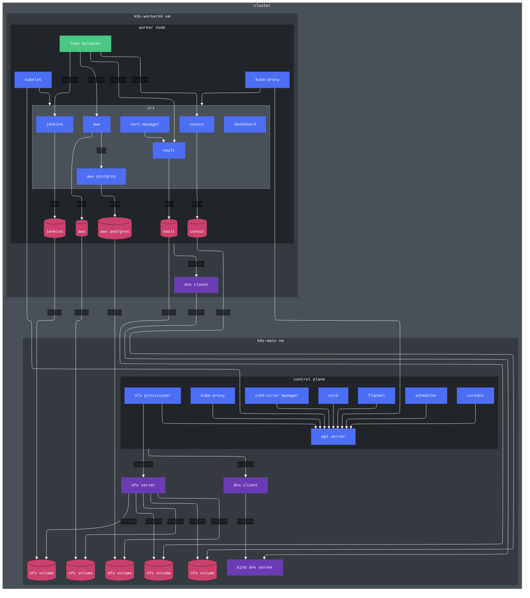

# k8s-lab

This repository contains automation to provision a Kubernetes cluster running the latest available version.

## Overview



> [!NOTE]
> Some components have not been included in the diagram to reduce the size and complexity

### Contents

| folder | purpose |
| ------ | ------- |
| packer | Packer template for Ubuntu Server 24.04 Vagrant box |
| vagrant | Vagrantfile for Kubernetes cluster lab |

## Provisioning flow

The Vagrantfile provisions one control plane node (`k8s-main`) and one or more worker nodes (`k8s-worker##`).

### Control plane node

- Virtual hardware
  - 2 vCPU
  - 4 GB RAM
- Synced folder(s)
  - `vagrant/files/` mounted to `/vagrant`
- Provisioners
  - `vagrant/files/common/main.yml`: Base OS configuration
  - `vagrant/files/bind/main.yml`: Bind DNS server with `lab.test` zone
  - `vagrant/files/nfs/main.yml`: NFS server for persistent volumes
  - `vagrant/files/k8s/common.yml`: Kubernetes common components (`containerd`, `kubelet`, etc.)
  - `vagrant/files/k8s/main.yml`: Kubernetes control plane components and setup

### Worker node(s)

- Virtual hardware
  - 2 vCPU
  - 4 GB RAM
- Synced folder(s)
  - `vagrant/files/` mounted to `/vagrant`
- Provisioners
  - `vagrant/files/common/main.yml`: Base OS configuration
  - `vagrant/files/bind/main.yml`: Bind DNS server with `lab.test` zone
  - `vagrant/files/nfs/main.yml`: NFS server for persistent volumes
  - `vagrant/files/k8s/common.yml`: Kubernetes common components (`containerd`, `kubelet`, etc.)
  - `vagrant/files/k8s/worker.yml`: Kubernetes worker node cluster join

### Services

After all VMs are provisioned, several provisioners are run to configure the Kubernetes cluster and install optional services.

#### Required services

These services are required for basic functionality of the cluster:

- Load balancer
  - File: `vagrant/files/k8s/services/load-balancer/main.yml`
- Kubernetes Dashboard
  - File: `vagrant/files/k8s/services/dashboard/main.yml`
- NFS Provisioner
  - File: `vagrant/files/k8s/services/nfs-provisioner/main.yml`
- Vault
  - File: `vagrant/files/k8s/services/vault/main.yml`
- cert-manager
  - File: `vagrant/files/k8s/services/cert-manager/main.yml`

#### Optional services

These services are optional:

- AWX
  - File: `vagrant/files/k8s/services/awx/main.yml`
- Consul
  - File: `vagrant/files/k8s/services/consul/main.yml`
- Jenkins
  - File: `vagrant/files/k8s/services/jenkins/main.yml`

### Certificates

HashiCorp Vault is deployed to the lab environment and configured as a private Certificate Authority using the PKI secrets engine.

### DNS

The control plane node (`k8s-main`) is configured as a DNS server with a DNS zone named `lab.test`. All VMs and services dynamically register DNS records in the `lab.test` during deployment.

> [!TIP]
> To use the DNS records from outside the lab environment, setup a conditional forwarder on your modem/router to forward DNS queries for the `lab.test` zone to the IP of the control plane node.

### Networking

The VMs provisioned by Vagrant are configured with a bridged network and one of the first configurations applied to each VM is to set the default route to the bridged network gateway address specified in `settings.yml`. The default VirtualBox host-only adapter with the 10.0.2.15 IP is left enabled. The bridged network adapter allows the VMs to communicate with each other and other devices on your network.

> [!NOTE]  
> The default values in `settings.yml` configure the additional network adapter to bridge with the host adapter `enp12s0` on the `10.0.3.0/24` subnet. These values can be modified as needed, but the subnet should not overlap with the VirtualBox host-only adapter on 10.0.2.15.

### Persistent volumes

Several services use the NFS Provisioner to provision NFS-based persistent volumes as needed. The corresponding NFS shares are hosted by the control plane node. The following services receive persistent volumes:

- AWX
- AWX Postgres database
- Consul
- Jenkins
- Vault

> [!CAUTION]
> The NFS shares for persistent volumes are hosted by the control plane node. If the control plane VM (k8s-main) is destroyed, the persistent volume data will also be destroyed!

## Requirements

- Physical host
  - Hardware
    - 4+ vCPU
    - 32+ GB RAM
    - 15+ GB available storage
        > [!NOTE]  
        > The VirtualBox VMs are provisioned as linked clones to conserve disk space.
  - Operating system
    - Ubuntu Linux 22.04+
  - Software
    - Ansible 2.16+
    - VirtualBox 7+
    - Packer 1.14+
    - Vagrant 2.x
      - `vagrant-disksize` plugin
      - `vagrant-reload` plugin
      - `vagrant-vbguest` plugin

## Usage

### packer

The `packer` directory contains a Packer template to build Vagrant box for VirtualBox with Ubuntu Server 24.04 LTS. The Vagrant box is used as base image for each of the Kubernetes cluster VMs.

The Vagrant box build takes approximately 15 minutes, but may vary depending on your hardware and internet connection.

The box file is output to  `packer/ubuntu-server-24.04/ubuntu-server-24.04.box` and is approximately 2.5 GBs.

1. Build the Vagrant box:

    ```shell
    # Set working directory
    cd packer/ubuntu-server-24.04/

    # Build the box
    packer build .
    ```

The Vagrant box build takes approximately 15 minutes, but may vary depending on your hardware and internet connection.

The box file is output to  `packer/ubuntu-server-24.04/ubuntu-server-24.04.box` and is approximately 2.5 GBs.

### vagrant

The `vagrant` directory contains the Vagrantfile to build the Kubernetes lab environment. To build the environment:

1. Review the settings variables in `vagrant/settings.yml` and update as necessary. The following settings variables are available:

    | Variable name | Default value | Purpose |
    | ------------- | ------------- | ------- |
    | `deploy_awx` | `true` | Switch to control AWX deployment |
    | `deploy_jenkins` | `true` | Switch to control Jenkins deployment |
    | `dns_zone` | `lab.test` | Name of DNS zone to setup for environment |
    | `gateway_ip` | `10.0.3.1` | Network gateway address |
    | `kubernetes_version` | `1.35` | Kubernetes version to deploy |
    | `load_balancer_ip_pool_range` | `10.0.3.50-10.0.3.70` | IP address range for load balancer service |
    | `main_ip` | `10.0.3.40` | Starting IP address for VMs |
    | `num_of_workers` | `2` | Number of worker nodes to provision |
    | `subnet_cidr` | `10.0.3.0/24` | Subnet CIDR block |

1. Provision the environment:

    ```shell
    # Set working directory
    cd vagrant

    # Provision
    vagrant up
    ```

1. Play

1. When finished, destroy the environment:

    ```shell
    # Set working directory
    cd vagrant

    # Destroy
    vagrant destroy --force
    ```

### Service access

Service information, such as assigned IPs and login tokens, is output to `vagrant/files/k8s/temp/`:

- AWX: `vagrant/k8s-latest/files/k8s/temp/awx.json`
- Consul: `vagrant/k8s-latest/files/k8s/temp/consul.json`
- Jenkins: `vagrant/k8s-latest/files/k8s/temp/jenkins.json`
- Kubernetes dashboard: `vagrant/k8s-latest/files/k8s/temp/dashboard.json`
- Vault: `vagrant/k8s-latest/files/k8s/temp/vault.json`
